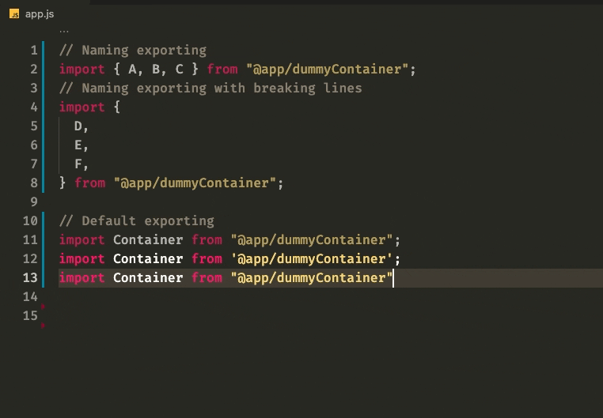
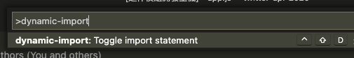
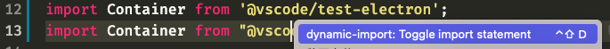

# dynamic-import README
## Features

For NextJS developers want to do code-splitting, this extension could help you to convert statements between static import and dynamic import.

## Usage

1. Move your cursor to a import statement. (If the statement is multi-lined, select it.)
2. Toggle import statement through `command`, `context menu` or `key binding (default: ctrl + shift + d)`.

## Known Issues

- Currently, this extension only support typescript.

## Release Notes

### 1.0.0

Initial release of dynamic-import
